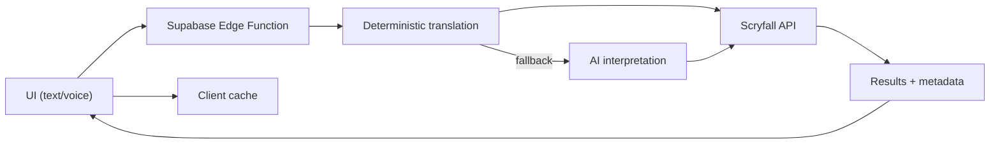

# OffMeta

[](https://github.com/vermosi/offmeta/actions/workflows/ci.yml)
[](https://offmeta.app)
[](LICENSE)
[](https://github.com/vermosi/offmeta)

[](https://react.dev/)
[](https://www.typescriptlang.org/)
[](https://tailwindcss.com/)
[](https://vitejs.dev/)
[](docs/testing.md)
[](https://lovable.dev)

**Natural language search for Magic: The Gathering cards, powered by Scryfall.**

> _Describe what you're looking for in plain English. No complex syntax. No guessing. Just natural conversation._

**Live demo:** [offmeta.lovable.app](https://offmeta.lovable.app)

---

## ✨ Features

| Feature | Description |
|---------|-------------|
| **Natural Language Search** | Describe cards in plain English — AI translates to Scryfall syntax |
| **200+ Deterministic Patterns** | Fast, cached translations for common queries without AI calls |
| **10 Progressive Search Guides** | Learn from basic type searches to expert multi-constraint queries |
| **Voice Input** | Hands-free searching with speech recognition |
| **Card Details** | Rulings, prices, printings, and legality in a clean modal |
| **Card Comparison** | Compare 2–4 cards side-by-side on stats, price, and legality |
| **Multiple View Modes** | Grid, list, and image-only views with persistent preference |
| **Export Results** | Copy card names or download CSV for deck builders |
| **Smart Filters** | Color, format, type, CMC, price, and rarity filter chips |
| **Client-Side Caching** | Sub-100ms response for repeated queries |
| **PWA Support** | Installable with offline-first architecture |
| **Dark/Light Theme** | Automatic system preference detection |
| **Mobile-First Design** | Responsive from 320px to 1920px with progressive spacing |
| **11-Language i18n** | Full UI and guide content localized in EN, ES, FR, DE, IT, PT, JA, KO, RU, ZHS, ZHT |

---

## 🚀 Quickstart

**Requires:** Node.js 20.11+ (see `.nvmrc`)

```bash
npm install
cp .env.example .env
npm run dev
```

---

## 📊 Built for Production

OffMeta includes enterprise-grade features:

- **Security**: 300+ security tests covering input sanitization, injection prevention, and rate limiting
- **Rate Limiting**: Server and client-side throttling with abuse prevention
- **CORS Protection**: Origin allowlist enforcement with proper security headers
- **Error Sanitization**: Prevents leaking file paths, stack traces, and credentials
- **Offline-First PWA**: Service worker with intelligent caching strategies

Run security tests:
```bash
npm run test -- src/lib/security
```

---

## ⚙️ Configuration

| Variable | Required | Description |
|----------|----------|-------------|
| `VITE_SUPABASE_URL` | Yes | Supabase project URL |
| `VITE_SUPABASE_PUBLISHABLE_KEY` | Yes | Supabase anon/publishable key |

For Edge Function environment variables, see [`docs/configuration.md`](docs/configuration.md).

---

## 🏗️ How It Works



1. You enter a natural-language query (text or voice)
2. The frontend sends the request to a Supabase Edge Function
3. The Edge Function deterministically translates the prompt to Scryfall syntax (AI is fallback only)
4. Results are fetched from Scryfall API, cached, and rendered

For architecture details, see [`docs/architecture.md`](docs/architecture.md).

---

## 🎯 Example Queries

Try these searches:

- `"artifact that produces 2 mana and costs four or less"`
- `"red or black creature that costs at least 5 mana and draws cards"`
- `"equipment which costs 3 and equips for 2"`
- `"green cards that let you sacrifice lands"`
- `"cards with cows in the art"`
- `"commanders with more than one color, one of which is blue"`

---

## 📖 Search Guides

OffMeta includes 10 progressive guides that teach natural language card search from beginner to expert:

| Level | Guide | Example Query |
|-------|-------|---------------|
| 1 | Search by Creature Type | `"dragons"` |
| 2 | Filter by Color | `"mono red creatures"` |
| 3 | Budget & Price Filters | `"budget board wipes under $5"` |
| 4 | Format Legality Search | `"commander staples under $3"` |
| 5 | Keyword Ability Search | `"creatures with flying and deathtouch"` |
| 6 | Ramp & Card Draw | `"green ramp spells that search for lands"` |
| 7 | Tribal Synergies | `"elf tribal payoffs for commander"` |
| 8 | Token & Sacrifice | `"creatures that make tokens when opponents act"` |
| 9 | ETB & Flicker Combos | `"cards that double ETB effects"` |
| 10 | Multi-Constraint | `"utility lands for commander in Esper under $5"` |

Browse all guides at [`/guides`](https://offmeta.lovable.app/guides).

---

## 📜 License (AGPL-3.0)

OffMeta is open source under the GNU AGPL v3. You are free to fork, modify, and self-host.

If you deploy a public instance (including hosted forks), you must make the corresponding source code available to users of that service, as required by the AGPL.

**Why AGPL?** We want improvements made to public deployments shared back with the community, instead of locked away in closed hosted clones.

Forks must rename the project and remove OffMeta branding when deployed publicly. See [TRADEMARK.md](TRADEMARK.md) for branding rules.

---

## 🤝 Contributing

Contributions are welcome! See [`CONTRIBUTING.md`](CONTRIBUTING.md) for setup, workflow, and checks.

1. Fork the repository
2. Create a feature branch
3. Submit a pull request

Browse [GitHub Issues](https://github.com/vermosi/offmeta/issues) for current tasks.

---

## 🔒 Security

For security vulnerability reporting, see [SECURITY.md](SECURITY.md).

---

## 📚 Documentation

| Document | Description |
|----------|-------------|
| [Architecture](docs/architecture.md) | System design and data flow |
| [Configuration](docs/configuration.md) | Environment variables and setup |
| [Development](docs/development.md) | Local development guide |
| [Testing](docs/testing.md) | Test suite documentation |
| [Guides](docs/guides.md) | Search guides system documentation |
| [Roadmap](docs/roadmap.md) | Planned features |
| [FAQ](docs/FAQ.md) | Common questions |
| [Internationalization](docs/i18n.md) | i18n system and translation guide |

---

## 📄 Legal

| Document | Description |
|----------|-------------|
| [LICENSE](LICENSE) | AGPL-3.0 License |
| [SECURITY](SECURITY.md) | Vulnerability reporting |
| [TRADEMARK](TRADEMARK.md) | Branding guidelines |
