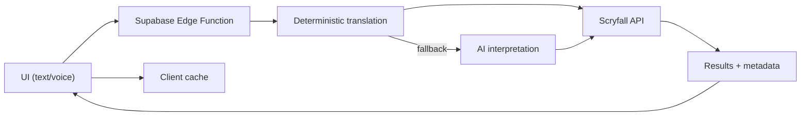

# OffMeta

[](https://offmeta.app)
[](https://github.com/vermosi/offmeta)

[](LICENSE)
[](https://react.dev/)
[](https://www.typescriptlang.org/)
[](https://tailwindcss.com/)
[](https://vitejs.dev/)
[](https://lovable.dev)

**Live demo:** https://offmeta.app (official instance operated by OffMeta via Lovable)

## Features

- Natural-language search with deterministic translation and AI fallback.
- Voice input for hands-free searching.
- Card detail modal with rulings, prices, and printings.
- Client-side caching and Scryfall rate limiting.
- Dark/light theme support.

## Quickstart

**Requires:** Node.js 20.11+ (see `.nvmrc`)

```bash
npm install
cp .env.example .env
npm run dev
```

## Configuration

| Variable                        | Required | Description                                       |
| ------------------------------- | -------- | ------------------------------------------------- |
| `VITE_SUPABASE_URL`             | Yes      | Supabase project URL used by the frontend client. |
| `VITE_SUPABASE_PUBLISHABLE_KEY` | Yes      | Supabase anon/publishable key.                    |

For Edge Function environment variables, see [`docs/CONFIGURATION.md`](docs/CONFIGURATION.md).

## How it works

- You enter a natural-language query in the UI (text or voice).
- The frontend sends the request to a Supabase Edge Function for interpretation.
- The Edge Function deterministically translates the prompt to Scryfall syntax and uses AI only as a fallback.
- The Edge Function queries the Scryfall API with the generated search string.
- Results are returned to the UI, cached client-side, and rendered as cards with details and printings.



For a deeper architecture overview, see [`docs/ARCHITECTURE.md`](docs/ARCHITECTURE.md).

## Usage examples

Try these sample queries:

1. "artifact that produced 2 mana and costs four or less mana"
2. "red or black creature that costs at least 5 mana and will draw cards"
3. "equipment which costs 3 and equip for 2"
4. "released after 2020"
5. "fits into a BR commander deck"
6. "rakdos creature"
7. "green cards that let you sacrifice lands"
8. "cards with cows in the art"
9. "creatures that care about graveyard order"
10. "commanders with more than one color, one of which is blue"

## Open source license (AGPL-3.0)

OffMeta is open source under the GNU AGPL v3. You are free to fork, modify, and self-host the project.

If you deploy a public instance (including hosted forks), you must make the corresponding source code available to users of that service, as required by the AGPL.

The official hosted version is run by OffMeta via Lovable. Forks must rename the project and remove OffMeta branding when deployed publicly. See [TRADEMARK.md](TRADEMARK.md) for branding rules.

### Why AGPL?

We want the project to stay open even when it's hosted as a service. AGPL ensures that improvements made to public deployments are shared back with the community, instead of being locked away in closed hosted clones.

## Deployment and secrets

This repository does **not** include production credentials. Real environment files are ignored by Git and must be provided by operators.

Lovable deployment details are intentionally excluded to avoid leaking operational configuration. Use the `.env.example` template to configure your own instance.

## Troubleshooting

- **Missing environment variables**: Ensure `.env` is populated and matches `.env.example`.
- **No search results**: Check the `Search Interpretation` panel to confirm the generated Scryfall syntax.
- **AI gateway unavailable**: The app will fall back to deterministic rules; results may be less precise.

## Support

- **Bugs & feature requests**: [GitHub Issues](https://github.com/vermosi/offmeta/issues)
- **Questions & help**: [GitHub Discussions](https://github.com/vermosi/offmeta/discussions) (if enabled)

When reporting issues, please include:

- Steps to reproduce
- Expected vs. actual behavior
- Environment details (OS, browser, Node.js version)
- Logs or screenshots when applicable

## Contributing

This project is open source under the AGPL-3.0 license. Contributions are welcome!

1. Fork the repository
2. Create a feature branch
3. Submit a pull request

See [`CONTRIBUTING.md`](CONTRIBUTING.md) for setup, workflow, and checks, or browse [GitHub Issues](https://github.com/vermosi/offmeta/issues) for current tasks.

---

## Legal

| Document                | Description                      |
| ----------------------- | -------------------------------- |
| [LICENSE](LICENSE)      | AGPL-3.0 License                 |
| [SECURITY](SECURITY.md) | Security vulnerability reporting |
