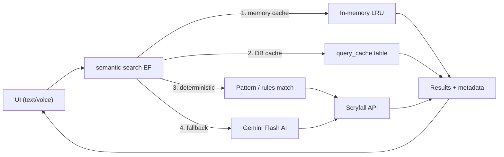

# Architecture

## Overview

OffMeta is a React 19 + Vite frontend that translates natural-language Magic: The Gathering card searches into valid Scryfall syntax, then queries Scryfall and renders results. It also features a full deck builder with AI-powered categorization, combo detection, and card suggestions. The app follows a mobile-first responsive design with standardized spacing across all breakpoints.

## High-level flow

1. **User input** (text or voice) is collected in `src/components/UnifiedSearchBar.tsx`.
2. **Backend edge function** (`supabase/functions/semantic-search`) transforms the query through a prioritized pipeline:
   - Memory cache → Persistent DB cache → Deterministic/pattern match → AI (Gemini Flash)
3. **Scryfall API** is queried via the frontend client in `src/lib/scryfall/client.ts`.
4. **Results** render in the card grid and modal components.



## Directory structure

```
src/
├── components/          # React components
│   ├── CardModal/       # Card detail modal (image, prices, rulings, legalities, combos)
│   ├── SearchHelpModal/ # In-app search help overlay
│   ├── deckbuilder/     # Deck editor sub-components (see below)
│   ├── ui/              # shadcn/ui primitives
│   └── __tests__/       # Component behavioral tests
├── data/                # Static data (guides, daily gems, archetypes, similar searches)
├── hooks/               # Custom React hooks
│   ├── useDeck.ts       # Deck CRUD state and Supabase sync
│   ├── useDeckPrice.ts  # Mainboard USD price aggregation via Scryfall collection API
│   └── ...
├── lib/
│   ├── core/            # Environment, logging, utils, monitoring
│   ├── deckbuilder/     # Deck utilities: sort-deck-cards, infer-category, decklist-formatters
│   ├── scryfall/        # Scryfall API client, query validation, printings
│   ├── search/          # Server-side filter construction
│   ├── security/        # Security utilities and test infrastructure
│   ├── regression/      # Regression test suites
│   ├── i18n/            # Lightweight i18n: 11 languages, JSON dictionaries
│   └── pwa/             # Service worker registration
├── pages/               # Route pages
│   └── __tests__/       # Page-level behavioral tests
├── integrations/        # Supabase client (auto-generated)
└── types/               # Shared TypeScript types (card, filters, search)

supabase/
└── functions/
    ├── _shared/              # Shared utilities: auth (JWT validation), rate limiting, env
    ├── semantic-search/      # Query translation pipeline
    │   ├── pipeline/         # Normalize → Classify → Slots → Concepts → Assemble
    │   ├── deterministic/    # IR-based deterministic translation
    │   ├── mappings/         # Keyword, archetype, slang, art-tag mappings
    │   ├── cache.ts          # Memory + persistent DB cache with LRU eviction
    │   ├── circuit-breaker.ts# AI gateway circuit breaker (fail-fast)
    │   ├── logging.ts        # Non-blocking async log queue
    │   ├── validation.ts     # Input/output sanitization and quality flags
    │   └── config.ts         # Centralized configuration constants
    ├── deck-categorize/      # AI functional categorization of deck cards (Gemini Flash)
    ├── deck-suggest/         # AI card suggestion engine for open deck slots
    ├── combo-search/         # Commander Spellbook combo search (in-deck + almost-there)
    ├── deck-recommendations/ # AI-powered full deck recommendations via Moxfield import
    ├── fetch-moxfield-deck/  # Moxfield deck import proxy (CORS bypass)
    ├── process-feedback/     # Feedback → AI rule generation (per-submission; verify_jwt = false)
    ├── admin-analytics/      # Admin analytics aggregation (requires admin role)
    ├── cleanup-logs/         # Log rotation (scheduled; companion to generate-patterns)
    ├── generate-patterns/    # Nightly batch: promote high-frequency logs → rules (pg_cron 03:00 UTC)
    └── warmup-cache/         # Cache pre-warming (scheduled)
```

### Deckbuilder sub-components (`src/components/deckbuilder/`)

The deck editor is split into focused single-responsibility modules:

| File | Purpose |
|------|---------|
| `constants.ts` | Shared constants, module-level caches (cardImageFetchCache, printingsByName, CATEGORIES) |
| `CardHoverImage.tsx` | Hover-triggered floating card image preview with 350ms debounce |
| `CardSearchPanel.tsx` | Natural-language / Scryfall card search with smart-search toggle |
| `CardPreviewPanel.tsx` | Right-panel card detail preview with rulings, legalities, and prints |
| `CategorySection.tsx` | Collapsible card category group with full row controls |
| `SideboardSection.tsx` | Sideboard board management section |
| `MaybeboardSection.tsx` | Maybeboard (considering) section |
| `VisualCardGrid.tsx` | Image-grid view mode for the mainboard |
| `PileView.tsx` | Pile view sorted by color identity (WUBRGCM columns) |
| `PrintingPickerPopover.tsx` | Printing/set picker popover with lazy Scryfall fetch and price display |
| `SuggestionsPanel.tsx` | AI card suggestions panel (deck-suggest edge function) |
| `DeckCombos.tsx` | Inline combo detection via Commander Spellbook (auto-fires at 10+ cards) |
| `DeckStats.tsx` | Real-time stats bar: mana curve, color pie, type breakdown, CMC average, price |
| `DeckExportMenu.tsx` | Export to text list, CSV, or copy card names |
| `DeckImportModal.tsx` | Import from Moxfield URL or plain text decklist |

## Key modules

| Module               | Location                                  | Purpose                                    |
| -------------------- | ----------------------------------------- | ------------------------------------------ |
| UI Components        | `src/components/`                         | Search bar, card grid, modals, compare     |
| Deck Builder         | `src/pages/DeckEditor.tsx`                | Full-featured deck editor (≈650 lines, delegates to sub-components) |
| Deck List            | `src/pages/DeckBuilder.tsx`               | User's deck library with create/import/delete |
| Guides               | `src/pages/Guides*.tsx` + `src/data/guides.ts` | 10 progressive search tutorials       |
| Archetypes           | `src/pages/Archetype*.tsx` + `src/data/archetypes.ts` | Commander archetype browser     |
| Combo Finder         | `src/pages/FindMyCombos.tsx`              | Commander combo discovery via Commander Spellbook |
| Deck Recommendations | `src/pages/DeckRecommendations.tsx`       | AI-powered deck improvement suggestions    |
| Scryfall Client      | `src/lib/scryfall/`                       | API calls, query validation, printings     |
| Deckbuilder Utils    | `src/lib/deckbuilder/`                    | sortDeckCards, inferCategory, decklist formatters |
| Core Utilities       | `src/lib/core/`                           | Environment, logging, monitoring           |
| Security Suite       | `src/lib/security/`                       | Security utilities, test helpers           |
| Search Pipeline      | `supabase/functions/semantic-search/`     | NL → Scryfall translation (4-layer pipeline) |
| Combo Search EF      | `supabase/functions/combo-search/`        | Commander Spellbook API proxy              |
| Deck Categorize EF   | `supabase/functions/deck-categorize/`     | AI functional card categorization          |
| Deck Suggest EF      | `supabase/functions/deck-suggest/`        | AI card suggestion engine                  |
| Deck Recs EF         | `supabase/functions/deck-recommendations/`| AI deck analysis edge function             |
| Moxfield Proxy       | `supabase/functions/fetch-moxfield-deck/` | Moxfield deck import proxy                 |
| Supabase Client      | `src/integrations/supabase/client.ts`     | Auto-generated DB client (do not edit)     |
| i18n                 | `src/lib/i18n/`                           | 11-language translation system             |

## Data stores

Supabase tables:

| Table | Purpose |
|-------|---------|
| `decks` | User deck metadata (name, format, commander, color identity, public flag) |
| `deck_cards` | Cards in a deck (board, quantity, category, scryfall_id) |
| `translation_rules` | Concept patterns and Scryfall mappings. Populated by `process-feedback` (per-submission) and `generate-patterns` (nightly batch). `source_feedback_id` links back to the originating `search_feedback` row. |
| `translation_logs` | Query translation history for analytics. Used as the source for nightly pattern promotion (entries ≥3 occurrences, ≥0.8 confidence). |
| `query_cache` | Persistent NL → Scryfall query cache (48h TTL) |
| `search_feedback` | User-reported translation issues. `processing_status` follows the lifecycle: `pending → processing → completed \| failed \| skipped \| duplicate \| updated_existing`. `generated_rule_id` links to the `translation_rules` row created for this submission. |
| `analytics_events` | Usage analytics (event-type + session-id) |
| `profiles` | User display names and avatars |
| `user_roles` | Admin / moderator role assignments |
| `saved_searches` | User-saved search queries with filter snapshots (max 100/user) |

## Authentication

Edge functions use a shared `validateAuth` helper in `supabase/functions/_shared/auth.ts` that accepts:

- **Service role key** — internal/admin access
- **Custom API secret** (`OFFMETA_API_SECRET`) — machine-to-machine integrations
- **Supabase JWTs** — both anon JWTs (`iss: 'supabase'`) and authenticated user JWTs (`iss: 'https://<project>.supabase.co/auth/v1'`) are accepted

> **Note**: Authenticated user tokens use a full URL issuer, not just `'supabase'`. The validator checks `payload.iss.includes('supabase')` to handle both forms.

## Error handling

- `src/components/ErrorBoundary.tsx` provides a user-friendly fallback for React runtime errors.
- Edge functions return JSON error payloads with appropriate HTTP status codes.
- The AI gateway circuit breaker (`circuit-breaker.ts`) trips after repeated failures, preventing cascading timeouts.
- Non-blocking log flushing (`logging.ts`) ensures logging never adds latency to the response path.
- `src/lib/core/monitoring.ts` provides hooks for error tracking integration.

## Performance

- **4-layer cache**: in-memory LRU → persistent DB cache → deterministic match → AI (AI only fires on cache+deterministic miss)
- **Non-blocking logs**: `flushLogQueue()` is fire-and-forget; response is sent before logs are written
- **Lazy image loading**: `CardHoverImage` waits 350ms before fetching, uses a module-level cache shared across the deck editor session
- **Scryfall collection API**: `useDeckPrice` batches up to 75 card names per request for price lookups
- **Input debounce**: search bar debounces at 300–500ms; session-level deduplication prevents identical concurrent queries

## Responsive design

The app follows a mobile-first approach with a standardized spacing system:

- **Sections** (How It Works, FAQ): `py-10 sm:py-14 lg:py-16`
- **Main content areas**: `py-8 sm:py-10 lg:py-12`
- **Discovery spacing**: `space-y-8 sm:space-y-10 lg:space-y-12`
- **Footer**: `py-6 sm:py-8`
- **Deck editor**: three-tab mobile interface (`search | list | preview/AI`)

## Alchemy exclusion

The Scryfall client (`src/lib/scryfall/client.ts`) automatically appends `-is:rebalanced` to all search queries to exclude Alchemy rebalanced card variants from results.

## Third-party integrations

| Service | Purpose | Integration Point |
| ------- | ------- | ----------------- |
| [Scryfall](https://scryfall.com) | Card search, images, prices, rulings, printings | `src/lib/scryfall/client.ts` |
| [Moxfield](https://moxfield.com) | Deck import for recommendations and deck editor | `supabase/functions/fetch-moxfield-deck/` |
| [Commander Spellbook](https://commanderspellbook.com) | Combo discovery (in-deck + almost-there) | `supabase/functions/combo-search/` |
| [Lovable AI Gateway](https://lovable.dev) | Gemini Flash for query translation, categorization, suggestions | `LOVABLE_API_KEY` secret |

Overflow protection is applied at the HTML root level (`overflow-x: hidden`) with `min-w-0` on content wrappers to prevent horizontal scroll on all viewports.
