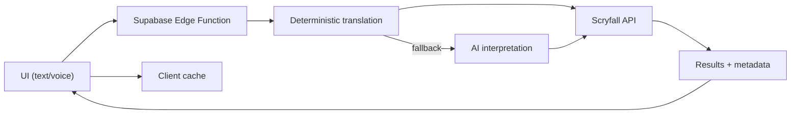

# Architecture

## Overview

OffMeta is a React 19 + Vite frontend that sends natural-language search queries to backend edge functions. The edge function translates user input into Scryfall syntax and returns results for display in the UI. The app follows a mobile-first responsive design with standardized spacing across all breakpoints.

## High-level flow

1. **User input** (text or voice) is collected in `src/components/UnifiedSearchBar.tsx`.
2. **Supabase Edge Function** (`supabase/functions/semantic-search`) transforms the query into deterministic Scryfall syntax, optionally using AI.
3. **Scryfall API** is queried via the frontend client in `src/lib/scryfall/client.ts`.
4. **Results** render in the card grid and modal components.



## Directory structure

```
src/
├── components/          # React components
│   ├── CardModal/       # Card detail modal (image, prices, rulings, legalities)
│   ├── SearchHelpModal/ # In-app search help overlay
│   ├── ui/              # shadcn/ui primitives
│   └── __tests__/       # Component behavioral tests
├── data/                # Static data (guides, daily gems, archetypes, similar searches)
├── hooks/               # Custom React hooks
├── lib/
│   ├── core/            # Environment, logging, utils, monitoring
│   ├── scryfall/        # Scryfall API client and query validation
│   ├── search/          # Server-side filter construction
│   ├── security/        # Security utilities and test infrastructure
│   ├── regression/      # Regression test suites
│   ├── i18n/            # Lightweight i18n: 11 languages, JSON dictionaries
│   └── pwa/             # Service worker registration
├── pages/               # Route pages
│   └── __tests__/       # Page-level behavioral tests
├── integrations/        # Supabase client (auto-generated)
└── types/               # Shared TypeScript types (card, filters, search)

supabase/
└── functions/
    ├── _shared/              # Shared utilities (auth, rate limiting, env)
    ├── semantic-search/      # Query translation pipeline
    │   ├── pipeline/         # Normalize → Classify → Slots → Concepts → Assemble
    │   ├── deterministic/    # IR-based deterministic translation
    │   ├── mappings/         # Keyword, archetype, and slang mappings
    │   ├── scryfall.ts       # Scryfall validation and query relaxation
    │   ├── validation.ts     # Input/output validation
    │   └── config.ts         # Centralized configuration constants
    ├── combo-search/         # Commander Spellbook combo search
    ├── deck-recommendations/ # AI-powered deck recommendations
    ├── fetch-moxfield-deck/  # Moxfield deck import proxy
    ├── process-feedback/     # Feedback processing pipeline
    ├── admin-analytics/      # Admin analytics aggregation
    ├── cleanup-logs/         # Log rotation
    ├── generate-patterns/    # Pattern generation from feedback
    └── warmup-cache/         # Cache pre-warming
```

## Key modules

| Module               | Location                                  | Purpose                                    |
| -------------------- | ----------------------------------------- | ------------------------------------------ |
| UI Components        | `src/components/`                         | Search bar, card grid, modals, compare     |
| Guides               | `src/pages/Guides*.tsx` + `src/data/guides.ts` | 10 progressive search tutorials       |
| Archetypes           | `src/pages/Archetype*.tsx` + `src/data/archetypes.ts` | Commander archetype browser     |
| Combo Finder         | `src/pages/FindMyCombos.tsx`              | Commander combo discovery via Commander Spellbook |
| Deck Recommendations | `src/pages/DeckRecommendations.tsx`       | AI-powered deck improvement suggestions    |
| Scryfall Client      | `src/lib/scryfall/`                       | API calls, query validation, printings     |
| Core Utilities       | `src/lib/core/`                           | Environment, logging, monitoring           |
| Security Suite       | `src/lib/security/`                       | Security utilities, test helpers           |
| Search Pipeline      | `supabase/functions/semantic-search/`     | NL → Scryfall translation                  |
| Combo Search EF      | `supabase/functions/combo-search/`        | Commander Spellbook API proxy              |
| Deck Recs EF         | `supabase/functions/deck-recommendations/`| AI deck analysis edge function             |
| Moxfield Proxy       | `supabase/functions/fetch-moxfield-deck/` | Moxfield deck import proxy                 |
| Supabase Client      | `src/integrations/supabase/client.ts`     | Auto-generated DB client                   |
| i18n                 | `src/lib/i18n/`                           | 11-language translation system             |

## Data stores

Supabase tables:

- `translation_rules` - Concept patterns and Scryfall mappings
- `translation_logs` - Query translation history
- `query_cache` - Persistent query cache
- `search_feedback` - User-reported translation issues
- `analytics_events` - Usage analytics

## Error handling

- `src/components/ErrorBoundary.tsx` provides a user-friendly fallback for React runtime errors.
- Edge functions return JSON error payloads with appropriate HTTP status codes.
- `src/lib/core/monitoring.ts` provides hooks for error tracking integration.

## Responsive design

The app follows a mobile-first approach with a standardized spacing system:

- **Sections** (How It Works, FAQ): `py-10 sm:py-14 lg:py-16`
- **Main content areas**: `py-8 sm:py-10 lg:py-12`
- **Discovery spacing**: `space-y-8 sm:space-y-10 lg:space-y-12`
- **Footer**: `py-6 sm:py-8`

## Alchemy exclusion

The Scryfall client (`src/lib/scryfall/client.ts`) automatically appends `-is:rebalanced` to all search queries to exclude Alchemy rebalanced card variants from results.

## Third-party integrations

| Service | Purpose | Integration Point |
| ------- | ------- | ----------------- |
| [Scryfall](https://scryfall.com) | Card search, images, prices, rulings | `src/lib/scryfall/client.ts` |
| [Moxfield](https://moxfield.com) | Deck import for recommendations | `supabase/functions/fetch-moxfield-deck/` |
| [Commander Spellbook](https://commanderspellbook.com) | Combo discovery | `supabase/functions/combo-search/` |

Overflow protection is applied at the HTML root level (`overflow-x: hidden`) with `min-w-0` on content wrappers to prevent horizontal scroll on all viewports.
