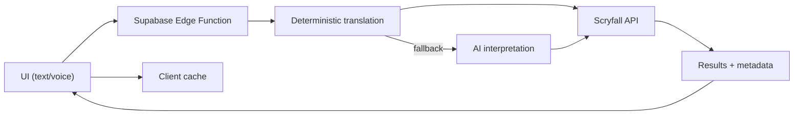

# Architecture

## Overview

OffMeta is a React + Vite frontend that sends natural-language search queries to Supabase Edge Functions. The Edge Function translates user input into Scryfall syntax and returns results for display in the UI.

## High-level flow

1. **User input** (text or voice) is collected in `src/components/UnifiedSearchBar.tsx`.
2. **Supabase Edge Function** (`supabase/functions/semantic-search`) transforms the query into deterministic Scryfall syntax, optionally using AI.
3. **Scryfall API** is queried via the frontend client in `src/lib/scryfall/client.ts`.
4. **Results** render in the card grid and modal components.



## Directory structure

```
src/
├── components/          # React components
│   ├── CardModal/       # Card detail modal (image, prices, rulings, legalities)
│   ├── ui/              # shadcn/ui primitives
│   └── __tests__/       # Component behavioral tests
├── data/                # Static data (guides, daily gems, similar searches)
├── hooks/               # Custom React hooks
├── lib/
│   ├── core/            # Environment, logging, utils, monitoring
│   ├── scryfall/        # Scryfall API client and query validation
│   ├── search/          # Server-side filter construction
│   ├── security/        # Security utilities and test infrastructure
│   ├── regression/      # Regression test suites
│   └── pwa/             # Service worker registration
├── pages/               # Route pages (Index, GuidesIndex, GuidePage, NotFound)
│   └── __tests__/       # Page-level behavioral tests
└── integrations/        # Supabase client (auto-generated)

supabase/
└── functions/
    ├── _shared/         # Shared utilities (auth, rate limiting)
    └── semantic-search/ # Query translation pipeline
        ├── pipeline/    # Normalize → Classify → Slots → Concepts → Assemble
        ├── mappings/    # Keyword and archetype mappings
        ├── deterministic.ts
        ├── validation.ts
        └── ...
```

## Key modules

| Module           | Location                              | Purpose                                |
| ---------------- | ------------------------------------- | -------------------------------------- |
| UI Components    | `src/components/`                     | Search bar, card grid, modals, compare |
| Guides           | `src/pages/Guides*.tsx` + `src/data/guides.ts` | 10 progressive search tutorials |
| Scryfall Client  | `src/lib/scryfall/`                   | API calls, query validation, printings |
| Core Utilities   | `src/lib/core/`                       | Environment, logging, monitoring       |
| Security Suite   | `src/lib/security/`                   | Security utilities, test helpers       |
| Search Pipeline  | `supabase/functions/semantic-search/` | NL → Scryfall translation              |
| Supabase Client  | `src/integrations/supabase/client.ts` | Auto-generated DB client               |

## Data stores

Supabase tables:

- `translation_rules` - Concept patterns and Scryfall mappings
- `translation_logs` - Query translation history
- `query_cache` - Persistent query cache
- `search_feedback` - User-reported translation issues
- `analytics_events` - Usage analytics

## Error handling

- `src/components/ErrorBoundary.tsx` provides a user-friendly fallback for React runtime errors.
- Edge functions return JSON error payloads with appropriate HTTP status codes.
- `src/lib/core/monitoring.ts` provides hooks for error tracking integration.
